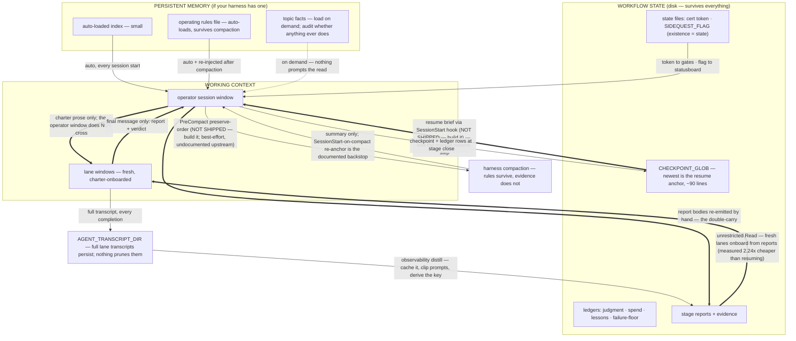

# The OAR Blueprint (v3) — Orchestration & Agent Rails

*An operating architecture for building real software with an AI orchestrator and AI
agent teams — where the human's judgment is cached, the machine's output is proven, and
the supervision burden falls as the project grows.*

---

## 1. The thesis: judgment caching

The scarce resource in human-AI collaboration is not model capability — it is human
judgment, and most teams *sample* it repeatedly instead of *caching* it. Every re-review
of similar output, every re-explanation of standards, every re-litigated decision is a
cache miss. This architecture is one move applied at three layers:

| Layer | The judgment | The cache | The instrument |
|---|---|---|---|
| **Product** | "this output is right/wrong" | executable oracles: test floors, lints, proofs, a judgment ledger | escape rate per round |
| **Process** | "this way of working fails" | a numbered lessons file (binding, with expiry) + an enforcement audit | rules promoted AND demoted |
| **Collaboration** | "this is how I decide" | a living owner profile the AI maintains | supervision cost over time |

The falsifiable one-liner: *if your AI collaboration gets more supervision-hungry over
time, you are sampling; if it needs less of you, you are caching.*

Judgment is uncomputable in general but locally cacheable. No model learns "good" in the
abstract — but every *specific* ruling can become a *specific* check. Read every defect
report from your owner as an un-automated test that has just revealed itself. What
remains after systematic caching is genuine taste — irreducible, and the only thing that
should still be reaching the human by late project.

## 2. The delivery loop

```
owner INSPECTS the frozen build (their copy; agents never touch it)
  → findings captured VERBATIM (the owner's words are the spec)
  → BACKTEST: replay the findings against the existing check suite first.
      An item an existing check should have caught = an ESCAPE — fix the
      check alongside the code, and count it.
  → INVESTIGATION, archaeology-first, no execution: classify each item —
      REGRESSED / NEVER-SHIPPED / NEVER-WORKED /
      FIXED-THE-FLOOR-NOT-THE-COMPLAINT / NEW-ASK / NEEDS-REPRO
  → numbered DECISION LIST, a recommendation on every line; owner rules in batches
  → BUILD round under the rulings
  → ORACLE MANUFACTURE: every closed item names the executable check that
      now covers it, or is explicitly marked UNCHECKED with the reason —
      recorded in the JUDGMENT LEDGER
  → certification = ONE command (the verify runner), exit 0 or it didn't happen
  → ESCAPE RATE published per round. If it does not fall, the loop is
      witnessing, not learning.
```

**Escape rate is a borrowed instrument, and saying so costs nothing.** It is the
standard QA measure of defects that reached the user because the process that should
have caught them did not. What is added here is the denominator: it is computed from
the judgment ledger, published per round, and held to a ceiling by a gate rather than
reported on a dashboard. §12 carries the citation.

Non-negotiables inside the loop, each present because it prevented a named
failure class on the reference build:

- **Verbatim capture; invent nothing.** Paraphrase is where requirements die.
- **Explicit disposition on every item.** A silent skip is a betrayal — and prose alone
  does not enforce this (the reference build found five silent skips *after* the rule
  was written; the audit that found them was mechanical).
- **Honest partials beat broken completeness.** An unusable deliverable is worse than a
  scoped one.
- **Investigation rounds never fix while they investigate** — an agent permitted to fix
  will always find the problem it can already solve.
- **Classify-before-execute.** Most "I thought we fixed that" reports are not
  regressions; the taxonomy prevents re-fixing the wrong thing.

## 3. Enforcement: ranked by who can rewrite the enforcer

Rules fail by layer, not by emphasis. Rank every rule by whether the thing that enforces
it is reachable by the agents it binds:

**Zone A — outside the agents' blast radius:**
1. The human at a gate (unforgeable; expensive; spend sparingly).
2. Server-side CI on a protected branch — re-judges the *resulting tree* on every push,
   so syntax-level bypasses all produce the same diff and are still seen. The first
   control an agent genuinely cannot edit.
3. Code ownership / required review on judgment-bearing paths (hooks, gate tooling,
   charters, CI config, fixtures). This is what stops an agent authoring its own judge —
   a local hook never can, because the process can rewrite the hook before it next runs.

**Zone B — inside the blast radius (useful friction, honestly labeled):**
4. Permission rules and hooks (bind every depth, fail loud — but they run in the
   operator's session from files in a writable tree).
5. Topology (read-only stages can't collide; serial stages can't race a shared resource).
6. Checklists. 7. Prose.

Know which zone each rule lives in and write it down. Until CI exists, the minimum
hardening for Zone B judges: hook fixtures inside the verify run (synthesized inputs,
expected verdicts), a **dead-man check** (a silently dead gate reads as failure — and
require it to prove that a hook that produces *no output* on a must-deny case scores
zero, not partial), and a judge-paths-clean check (an uncommitted edit to a judge
invalidates certification — certification is a property of a *tree*, not a directory;
only a cold clone, which is what CI is, can prove what was actually committed).

**Promotion AND demotion.** When a prose rule fails in practice: record it, promote it a
layer or mark it accepted with the reason. And the reverse gear, because
under-enforcement produces an incident with a timestamp while over-enforcement produces
work that never happened and leaves no artifact: every rule carries a last-fired date;
any rule that has not fired in N stages gets reviewed — retire, demote, or re-affirm.
Zero demotions across an entire phase is itself a finding. (**"Stage"** and **"round"**
are defined once, in `modules/04-ledgers/README.md`, and every other document in the kit
uses them in that sense. A stage is one chartered unit of work, so "three stages" is a
shorter threshold than it sounds; read the definition before you size N.)

## 4. The role model

| Seat | Does | Never does |
|---|---|---|
| **Owner** (human) | Rules at gates, inspects the product, files findings, sets direction | Touches the working tree |
| **Orchestrator** (top-tier model, one seat) | Charters, launches, synthesizes, saves reports verbatim, commits, talks to the owner | Executes lane work; burns its tier on mechanical tasks |
| **Lane agents** (mid-tier) | One chartered lane each: scout / implement / verify / report | Commit, write reports to disk, touch the owner's build, exceed their lane |
| **Sub-agents** | Inherit their parent's tier | Escalate tier |

Three structural rules that make this work:

- **The andon cord.** Every lane at every depth may halt the round: return
  `verdict: HALT` with a reason, and the orchestration mechanically stops launching.
  Halts are counted and published; zero halts across a phase is a finding, not a
  success. Every synthesis/writer charter *opens* with the HALT guard: empty or
  placeholder inputs → halt immediately (on the reference build, dataless writer runs
  cost six figures of tokens, twice, before this guard existed).
- **Verifiers onboard from the spec side.** Reviewers receive the owner's verbatim
  findings, the rulings, and the diff — never the implementer's report. The
  implementer's mandatory "consciously left out and why" section is a claim the reviewer
  independently cross-checks, because omission-by-misunderstanding is invisible from the
  inside. On the reference build, the first spec-side review found blockers the
  implementer's honest self-report structurally could not see.
- **Model tiering is hook-enforced, not remembered.** Every spawn declares its tier; an
  undeclared spawn is denied loudly. Orchestrator-tier burn is the #1 cost failure mode
  and prose does not stop it.

## 5. Oracle-manufacturing doctrine

The verification playbook, general form (each law paid for at least once on the
reference builds):

1. **Allowed universe.** Define the closed set of permitted facts/effects; anything
   outside it is a defect by definition — deterministically detectable.
2. **Drop don't dilute — AND don't drop the true.** A half-grounded claim shown with a
   caveat is worse than withheld; an over-aggressive gate that rejects true output is
   its own failure class. The definition of "what the human said" must be complete
   before the gate is trusted.
3. **Grounded ≠ coherent.** Every part real does not make the combination right;
   coherence needs its own oracle, soft-flagged until its precision is proven.
4. **Verify the oracle against its source.** A guardrail is only as trustworthy as the
   data behind it — and an over-firing alarm erodes trust the way a silent drop erodes
   safety. Precision of the guardrail is its own quality bar.
5. **Negative controls, always.** A check is proven by making it go red. A gate never
   seen red is unproven. (Corollary from the reference build: a *self-referential* test
   can pass by matching its own source — assemble needles at runtime.) This is mutation
   testing's premise applied to gates rather than to unit tests: DeMillo, Lipton and
   Sayward established in 1978 that a test suite is evaluated by whether an injected
   fault makes it fail, and a gate that has never been made to fail is unevaluated by
   the same argument. §12 carries the citation.
6. **Loud failure over silent drop, at every layer including plumbing.** A correct
   answer must not die to a missing brace; a salvaged answer is flagged, never laundered.
   "The check did not run" and "the check passed" must never look the same — partial
   runs get their own verdict word and exit code.
7. **Verify in the target environment.** A pass is scoped to the environment it ran in;
   simulate the target's distinguishing property inside the gate. (Reference-build
   instance: the test suite silently depended on OS window *focus* — unattended runs
   read as regressions until the dependency was found and floored.)
8. **Continuity is a gate.** Snapshot checks certify a moment; users live across builds.
   State written by build N must load in build N+1, checked mechanically, with fixtures
   minted at every certification.
9. **The guards don't reach the story you tell about the project.** Retrospective prose
   hallucinates like a model does. Every claim in reports cites a primary source — a
   ledger row, a commit, a transcript — or is marked unverified. This document holds
   itself to that (see the evidence appendix).

## 6. Cost discipline, with denominators

The shape is the SRE error budget — a ceiling declared in advance, actuals measured
against it, and a consequence when it is spent — applied to process spend instead of
unreliability. The ratio is what makes overspending on ceremony as legible as
overspending on tokens. §12 carries the citation.

- A ledger row per stage with actual spend vs forecast. The budget never silently cuts
  scope; scope is the owner's ruling.
- **The ratio:** process spend (scouts, reviewers, writers, orchestration) over
  implementation spend, published per stage, with a declared ceiling. Overspending on
  the expensive model is legible as failure; overspending on *ceremony* is legible as
  rigour — the ratio is the only instrument that catches the second kind.
- **Book the rework.** Killed runs and re-runs are invisible to per-stage ledgers unless
  hunted; on the reference build, 10% of all observed agent output was rework no ledger
  row showed. A rework column makes it visible; the HALT guard makes the biggest class
  of it cheap.
- Any cost claim this architecture makes about itself is labeled with what it measures
  and what it lacks.

## 7. The context layer

The caches above live in files. This section is about the layer they defend against:
everything that exists only inside a model's context window. Three layers, separated by
one test — *does it survive a session clear without anyone remembering to carry it?*

| Layer | What it is | Survives a clear? | Survives compaction? |
|---|---|---|---|
| **Persistent memory** | the rules file; any harness auto-memory | yes — auto-loads | yes — re-injected from disk |
| **Workflow state** | checkpoints, ledgers, charters, state files, stage reports | yes — but only if the next session *reads* it | yes (it never left disk) |
| **Working context** | the operator's window; each lane's window | **no — all of it** | summary only; full tool output is gone |

The boundary map — what crosses, when, and what is lost:

- **Session → session: only disk crosses.** The newest `{{CHECKPOINT_GLOB}}` file is
  the resume anchor (module 01's first rule); ~90 lines is the measured norm for a
  resume-grade checkpoint. Everything not on disk at the clear is gone — which is why
  stage closes write to disk before anything else, and why the clear mark can sit as
  low as 75%: a good checkpoint makes clearing nearly free.
- **Session → lane: the charter prose crosses; nothing else does.** Not the operator's
  window, not harness memory, not sibling lanes' findings. A lane knows exactly what
  its charter says — charter quality is a cost variable, and the HALT guard (§4) exists
  because a boundary crossed with an empty payload once cost six figures of tokens,
  twice.
- **Lane → session: the final message only.** The lane's transcript is the discarded
  remainder — *reports are the onboarding; transcripts are not.* Measured: a lane
  resumed across five stages climbed monotonically to 2.24× the cost of a fresh lane
  onboarded from the reports on disk, and the fresh lane did strictly more work.
  Default to fresh lanes at stage boundaries; resumption requires a stated reason.
- **Through compaction: rules survive, evidence does not.** The harness re-injects the
  rules file and summarizes everything else; tool output is dropped. Anything not yet
  on disk survives only as whatever the summarizer chose to keep. The status board's
  clear mark (module 05) is the instrument, and **the mark encodes a property of your
  documentation, not of the model**: it sits where clearing beats continuing, and what
  makes clearing cheap is the checkpoint.
- **Transcripts persist — treat them as a cache, not the record.** On at least one
  harness, every lane's full transcript lands on disk permanently and nothing prunes
  it; the reference build measured half a gigabyte of unread lane transcript against
  ~53 MB of session transcript. Distill first (observability reports), then prune.
  Never prune first — the reference build's rework audit was only possible because the
  raw transcripts still existed.



**Two edges in that picture are marked NOT SHIPPED.** The SessionStart and PreCompact
hooks ran on the reference build and no file in this kit implements them; the resume
step is manual until you build them. `CONTEXT-ARCHITECTURE.md` §6 is the design brief.

The full treatment — what each layer looks like, the management disciplines, the
harness wiring with its hard-won portability rules — is `CONTEXT-ARCHITECTURE.md`
at the kit root; this section is its five-bullet doctrine.

No module owns this layer, deliberately: four modules already implement its pieces
(01 the checkpoint slot and the resume rule, 04 the zero-context future seat, 05 the
pressure bar and the flag-file contract, 06 the context capsule), and `kit.config`
already declares every slot it needs. What this section adds is the doctrine that
connects them. The resume *wiring* — SessionStart/PreCompact hooks that inject the
newest checkpoint automatically — is harness-specific and falls under §9's standing
caveat; the doctrine (checkpoint anchor, fresh-lanes-by-default, disk-first, distill-
then-prune) is not. **The kit ships neither hook**, nor the handoff PreToolUse gate
described alongside them: `CONTEXT-ARCHITECTURE.md` §6 documents all three as the
reference build's wiring, written as a design brief for an adopter to build from.

## 8. The collaboration layer

The product and process caches are mechanical. The third cache is the human interface,
and without it every session re-samples the owner's working style — the same failure the
judgment ledger kills, one layer up.

- **The default contract** (module 08): eight defaults proven across two reference
  builds — recommendation-first; validation gates on real output; verbatim capture;
  explicit dispositions; honest partials; blameless ownership with structural fixes;
  loud failures; feel-words treated as un-instrumented measurements. Adopt as the floor;
  override deliberately.
- **The seed interview:** five questions in the first session — decision style
  (lean vs menu), checkpoint shape, acceptance test, pushback license, the betrayal
  line. Fifteen minutes yields a v0.1 profile.
- **The living profile:** a document the AI maintains about the owner, *at the owner's
  request, to compensate for their blind spots*. One-off impressions wait for a second
  sighting; confirmed patterns get promoted; every change is dated in a revision log;
  the owner reads and corrects it. The profile is earned across the first project, not
  written on day one — and it explicitly survives model and session changes, because it
  is written as a handoff note to the next collaborator.

Honesty bar for this layer: it has the least evidence of the three (one owner, two
projects). The defaults are presented as proven-on-reference, not universal. Instrument
the transfer when you adopt: track supervision minutes and escape rate from day one.

## 9. The modules and their contracts

Eight modules, separately adoptable; coupling only through documented file contracts. A
kit whose modules only work as a bundle is a framework, and "no framework" is the
thesis. See each module's README for its contract; see `QUICKSTART.md` for the first
hour; see `kit.config.example` for every slot.

| # | Module | Contract surface |
|---|---|---|
| 01 | Governance (rules file + charters) | `kit.config` slots (tiers, paths, roles) — substituted into the rules file and every charter; consumed by nothing else |
| 02 | Enforcement (hooks + fixtures) | settings file; kit.config tiers |
| 03 | Verification (runner skeleton + oracle worksheet) | gate table; exit contract 0/1/2/3 |
| 04 | Ledgers (judgment / failure-floor / lessons / spend) | written by stage closes |
| 05 | Statusboard | reads `.claude/sidequest.json` if present |
| 06 | Sidequest (bounded-detour skill) | writes/deletes `.claude/sidequest.json`; KNOWLEDGE_DIR |
| 07 | CI (workflow + protection notes) | runs the module-03 runner; exit-3 contract |
| 08 | Collaboration (contract + interview + profile) | `kit.config` supplies `{{KNOWLEDGE_DIR}}` to the profile template; opens ledger rows per its file contract |

**The honest caveat, up front:** the doctrine (sections 1–8) is tool-agnostic. The
enforcement *wiring* (hooks, skills, statusline) assumes the Claude Code harness. On a
different agent stack, keep the doctrine and rebuild the wiring; on Claude Code, the kit
stands up in a session — see `QUICKSTART.md` for the per-step budget.

## 10. Bootstrap, in order

1. Git from minute one; remote + CI running the verify skeleton as early as affordable.
2. **Manufacture the first oracle before building what it measures** (module 03's
   worksheet). If you cannot state the check for "done," you are not ready to charter
   the lane.
3. Pin the toolchain; keep the working tree off cloud-sync paths (a sync daemon is a
   mutating filesystem under your certification).
4. Wire the hooks; **pipe-test every one and prove one live block plus one dead-man
   failure** before trusting anything.
5. Frozen owner build + written advance procedure the moment there is anything to
   inspect.
6. First session: seed interview; findings folder; verbatim-capture habit; judgment
   ledger on the first ruling; escape-rate line on the second round.

## 11. Evidence appendix (the reference build, de-identified)

All figures from one reference build (a ~96,000-line game rebuilt from a ~9,400-line
prototype by tiered agent teams over ~10 days) plus one prior knowledge-product build;
primary sources are the reference repo's ledgers and stage reports. Claims scoped
accordingly — this is a field-tested playbook with receipts, not a proven universal.

- **Judgment cache:** 158 owner rulings mapped to their enforcing checks; 95 CHECKED /
  44 pending / 12 unchecked at mapping time.
- **Baseline escape rate:** of 26 defect/fidelity findings from the owner's last
  pre-cache inspection, today's suite would catch 15 (58%) before the owner saw them —
  11 of those *mechanically proven* by replaying checks against the historical tree.
  Honest caveat: those checks were authored from those findings; the measure is
  conversion completeness, and the predictive instrument is the trend from the next
  round on.
- **The kit's own escape rate, computed rather than narrated:** the number is
  published by the tool, not by this page. Run
  `python modules/04-ledgers/escape_rate.py --ledger KNOWN-ISSUES.md` and read
  the summary line; the register's "The kit's own numbers" section prints the
  same output beside the table it is computed from. *[Round 32 (R32-4): this
  bullet carried "26 of 120 items (21.7%) across 12 counted review rounds" — a
  figure last true at round 12 — in the same sentence as the claim that the
  tool recomputes the number on every push. A hand-copied figure standing
  beside a claim that it is computed is exactly the drift the tool exists to
  remove, so the figure is removed rather than refreshed.]* It does **not**
  fall monotonically: it spikes at the rounds where the kit had just built new
  machinery. Method, per-round table,
  the disputable classification calls and the ceiling's derivation are in
  `KNOWN-ISSUES.md` ("The kit's own numbers"); `modules/04-ledgers/escape_rate.py`
  recomputes it from that table and CI recomputes it on both hosts on every push. This
  is the kit turning its own headline instrument on itself, unflattering half included.
- **Spec-side review, first use:** 3 blockers + 6 majors found pre-commit in a
  certification tool the implementer had honestly self-reported — including the classes
  "a partial run can be quoted as a pass" and "every count can shrink to zero and stay
  green." The implementer's disclosed-omissions list and the reviewer's overlapped on 3
  items; the reviewer found 5 more the implementer structurally could not see.
- **Cost:** process/implementation ratio across four certified rounds: 0.21–0.36
  (proposed ceiling 0.40); rework found by audit: 10.1% of observed agent output, none
  of it previously on a ledger; the orchestration layer itself: zero lines of framework
  code.
- **Verification depth at close:** 9-gate single-command certification (parity, proofs,
  compile, save-continuity, lints, live smoke, hook fixtures with dead-man, judge-paths,
  toolchain pin), 118-case selftest on the runner's own judging logic, CI green on a
  cold clone from the first push.
- **Determinism dividend:** because the sim was command-log + digest architected, a
  cross-build replay instrument cost ~470 lines and runs at ~9,000 ticks/sec — the
  domain prerequisite ("build your mechanical ground truth first") in one number.
- **Context layer (§7's receipts):** the same lane resumed across five stages climbed
  503k → 916k output tokens monotonically; the fresh replacement did strictly more work
  for 409k (2.24×). Report bodies double-carried through the operator window: ~195 KB
  per quest until the handoff convention. Lane transcripts persisted on disk, unread
  and unpruned: ~510 MB against ~53 MB of session transcript. Resume brief + compaction
  hooks: pipe-tested 17/17 with negative controls and a dead-man fixture on the
  reference build.

**Known limits:** **n=2 independently built projects, plus one same-owner
transplant** — the reference build and the prior knowledge-product build, and
then the brownfield host in `docs/CASE-STUDY-INCREMENT.md`, which is the same
owner's project, was governed for one afternoon, and was adopted and improved
by agents rather than by a person. The case study itself states that it "is not
an independent-adopter study, and it does not claim to be one". *[Round 32
(R32-4): this line read "n=3 projects", which reads as three projects' worth of
evidence and is the sentence most likely to travel out of this page on its own.
The transplant is counted separately above rather than folded into the
headline.]* One owner, one AI family. Collaboration-layer evidence
is n=1; portability demonstrated by the tested bootstrap in a scratch project
and one same-owner brownfield increment, not yet by an independent adopter. **The adoption evidence is synthetic:**
the seven walks behind this kit's own finding counts were performed by LLM personas,
not by people, and no human has walked `QUICKSTART.md` end to end. The prompts are
published under `docs/walks/` so the method can be read and re-run — that makes the
study reproducible, not independent. The first independent adoption is the
experiment; instrument it.

## 12. Lineage

Every mechanism in this document was re-derived from a failure on the reference build,
and almost every one of them has an older name. Both facts are true and the second is
not a subtraction: a practice that two independent derivations arrive at is better
evidenced than one only this project found. This section names the ancestors, so a
reader who already knows them does not have to decide whether the omission was
ignorance or concealment.

**How to read the source column.** A source marked *fetched* was retrieved and read
during the prior-art audit that produced this section. A source marked *search-result*
had its URL and title returned by a live search, with the description one remove from
the page itself. A row marked *no named artifact found* is a practice the audit could
describe but could not attribute to a specific published source, and it says so rather
than inventing one. The audit ran on 2026-08-22.

| Mechanism (this document) | Named ancestor | Source | What this kit adds |
|---|---|---|---|
| Negative controls: a gate never seen red is unproven (§5, law 5) | Mutation testing. DeMillo, Lipton and Sayward, "Hints on Test Data Selection: Help for the Practicing Programmer", *IEEE Computer* 11(4), 1978, established that a test suite is evaluated by whether an injected fault makes it fail | search-result: `https://www.scirp.org/reference/referencespapers?referenceid=953139` | The argument is applied to governance gates rather than to unit tests, made a shipped requirement over *every* check rather than a sampling technique, and paired with a dead-man clause that scores a silent gate as zero rather than as partial |
| Escape rate (§2, §11) | Defect escape rate, a standard QA and delivery metric: the share of defects that reached the user because the process that should have caught them did not, with published benchmark bands | search-result: `https://dzone.com/articles/how-to-measure-defect-escape-rate-to-keep-bugs-out`, `https://plandek.com/blog/escaped-defects` | The denominator. It is computed from the judgment ledger rather than a bug tracker, published per round, held to a declared ceiling, and printed as a required line on a certifying run instead of shown on a dashboard |
| Ratio ceiling with published actuals (§6) | The SRE error budget: a ceiling declared in advance, actuals measured against it, and a consequence when it is spent | fetched: `https://sre.google/sre-book/embracing-risk/` | Process spend substituted for unreliability. The ceremony ratio is what makes overspending on process as legible as overspending on tokens; the audit found no prior instrument measuring process spend over implementation spend |
| Verifiers onboard from the spec side (§4) | Independent verification and validation, where the reviewing party is organisationally separate from the developing one | search-result: `https://csrc.nist.gov/glossary/term/independent_verification_and_validation` | The agent-specific form is negative — it specifies what the reviewer must **not** be shown, namely the implementer's own account of the work — plus the implementer's mandatory "consciously left out" section as a claim the reviewer cross-checks |
| Judgment ledger (§1, module 04) | The requirements traceability matrix (requirement → test case, with sign-off and audit trail); and NIST OSCAL, its machine-readable form, where an assessment finding traces to the control statement it tests | search-result: `https://www.perforce.com/resources/alm/requirements-traceability-matrix`, `https://csrc.nist.gov/projects/open-security-controls-assessment-language` | The left column is the owner's ruling in their own words rather than a written requirement, and UNCHECKED is a first-class recorded state with a reason instead of a coverage gap read off an empty cell |
| Blameless ownership, structural fixes (§8) | SRE postmortem culture, where the postmortem assumes everyone acted reasonably on the information they had and the remedy is a change to the system rather than to a person | search-result: `https://sre.google/sre-book/postmortem-culture/` | Applied to an agent loop, where the "person" is usually a lane that no longer exists, so the structural fix is the only remedy available |
| Certification is a property of a tree, proven by a cold clone (§3) | Software supply-chain provenance: only a build from a cold clone attests what was actually committed. SLSA and in-toto are the current form of the argument | search-result: `https://slsa.dev/spec/v1.0/distributing-provenance`, `https://slsa.dev/blog/2023/05/in-toto-and-slsa` | The kit attests governance conduct rather than artifacts, and explicitly declines to build a second attestation system inside itself — see `docs/SECURITY-SCOPE.md` |
| Loop termination: the one-round default (§2, and module 01's WHEN THE LOOP ENDS) | Review-round practice, which reports diminishing returns after the first or second round and recommends approving with comments when the findings are all nits | search-result: `https://mtlynch.io/human-code-reviews-2/`, `https://zylos.ai/research/2026-03-01-multi-model-ai-code-review-convergence/` | Two rules the audit did not find stated elsewhere: each round's worst finding must be less severe than the last or the loop is a redesign signal, and a discovery loop may close AT CAP and NOT-DRY provided it records that it did |
| Promotion **and** demotion, with last-fired dates (§3) | Retiring controls that have stopped firing is ordinary practice in control rationalisation and in detection engineering | no named artifact found — the audit searched for one and reports the negative result | Forcing the disposition on a schedule, and treating a phase with zero demotions as a finding rather than as a clean run |
| Andon cord (§4) | The Toyota Production System, where any worker on the line may stop it | **unverified.** The audit did not reach a primary source for jidoka or the andon cord this session; the attribution is recorded as commonly held rather than as checked | Halts are counted and published, the authority runs to the *lowest* agent at any depth, and a phase with zero halts is read as a broken cord |
| The claims-governance apparatus as a family (`tools/citation_lint.py`, `tools/count_lint.py`, `tools/skim_lint.py`, `tools/repeat_lint.py`) | The FTC advertising substantiation doctrine: an advertiser must possess a reasonable basis for an objective claim **before** it is disseminated, the substantiation must continue to support the claim for as long as the claim is made, and the level required scales with "the consequences of a false claim" among other factors | fetched: `https://www.dwt.com/insights/2024/03/how-to-substantiate-advertising-claims`, a practitioner summary of the FTC Policy Statement Regarding Advertising Substantiation (1984). The Commission's own page for the statement returned HTTP 403 to this session and was not read; the doctrine is therefore attributed at one remove and the tier says so | The doctrine is implemented as gates on a certifying run rather than as an enforcement standard applied after publication, and the substantiation is a check that has itself been proven able to refuse |
| `tools/repeat_lint.py` (a universal claim stated in more than one document, so correcting one copy leaves the others standing) | No named artifact checking cross-document CLAIM duplication was found — the round-32 fix pass searched briefly and reports the negative result at that depth. The adjacent classes are real and named: near-duplicate text detection (plagiarism and code-clone tooling) finds repeated TEXT without asking whether it asserts anything, and single-document consistency checkers (the statcheck family, row below) recompute claims without crossing documents. The intersection — repeated ASSERTIONS across documents, flagged because corrections do not travel — is the part this audit did not find shipped | no named artifact found; the search was one fix-pass session deep and the tier says so — a future audit that finds the ancestor corrects this row, which is what rows here are for | Added in the round-32 fix pass because this tool shipped WITHOUT a lineage row in the same commit that made lineage rows a ship requirement — the requirement's first firing, on its own round's component |
| `tools/count_lint.py`, the count layer (is the stated number the number) | **statcheck** (Nuijten and Epskamp): "Extract Statistics from Articles and Recompute P-Values", described by its own package as "a 'spellchecker' for statistics" — it locates reported results in a document, recomputes them, and flags where the document disagrees with itself | fetched: `https://cran.r-project.org/web/packages/statcheck/index.html` | The same discipline over markdown rather than over APA statistics: the enumerable target is a table, list or fenced block, the tool decides only what it can locate, and it publishes its own coverage percentage rather than a bare state word |
| `tools/citation_lint.py` (does the quoted string exist in the document it names) | **Clearbrief**, a shipped Microsoft Word add-in for litigators that verifies the accuracy of quotations against the cited record and ships a Cite Check Report — "an audit trail showing that every citation in a document has been systematically verified" and "a permanent record that demonstrates due diligence before filing" | fetched: `https://www.lawnext.com/2025/12/clearbrief-launches-cite-check-report-to-give-law-firm-partners-an-audit-trail-against-ai-hallucinations.html`, `https://www.clearbrief.com/` | Deterministic string containment with a wrapped-quotation rule rather than a semantic score, run as a gate on a certifying run rather than as a tool a person invokes, and carrying registered negative controls that prove it can refuse |
| `tools/skim_lint.py` (is the artifact named inside the window a reader who stops early has seen) | Nearest parts only: **repolinter** (archived) applied configurable content-existence rules to repository files; **markdownlint** rule MD041 constrains the first line of a file to be a top-level heading; the reader model is newspaper and web above-the-fold doctrine | fetched: `https://github.com/todogroup/repolinter` ("Lint open source repositories for common issues"; the project page carries the notice that it has been archived), `https://github.com/DavidAnson/markdownlint/blob/main/doc/md041.md` (MD041, "First line in a file should be a top-level heading") | **No ancestor was found for the specific form** — a declared window with its derivation printed on every run, an inline literal expectation, reachability decided inside the window, a state word with a denominator, and a distinct abort code. The parts are old; the audit did not match the composition |
| `docs/CASE-STUDY-INCREMENT.md`, its paired **Establishes** and **Does not establish** reporting form | Runeson and Höst, "Guidelines for conducting and reporting case study research in software engineering", *Empirical Software Engineering* 14(2) 131–164, 2009 — the standard reporting discipline for case studies in this field | search-result: `https://dblp.org/rec/journals/ese/RunesonH09.html`. The paper itself was not read this session; only its bibliographic record was retrieved, and nothing about its contents is claimed here beyond its title | The validity section is written before the result rather than after it, and the study reports a miss rate computed on the host repository. Naming the guideline is a claim about form, not about compliance: no assessment against the guideline was run |

*[Round 32 (R32-3): the six rows above were added after an adversarial
prior-art lane found that §12 had been built for §1–§11 and did not travel to
the three lints, the claims apparatus or the case study shipped after it. That
is an escape in this kit's own vocabulary — a check existed and did not fire on
new surface — and the structural fix is the ship requirement recorded in the
ship checklist, not this table. Every source in these rows was retrieved and
read in round 32 before the row was written; where a page could not be
retrieved, the row says so and drops to the tier the evidence supports.]*

**What the ancestry audit does not change.** Naming an ancestor is not conceding the
mechanism was copied — each of these was re-derived from a specific failure, and the
register records which. It is conceding that the re-derivation is not the interesting
part. `COMPARISON.md` carries the same discipline against live competitors rather than
against ancestors, and states which of this kit's claims survive it.
