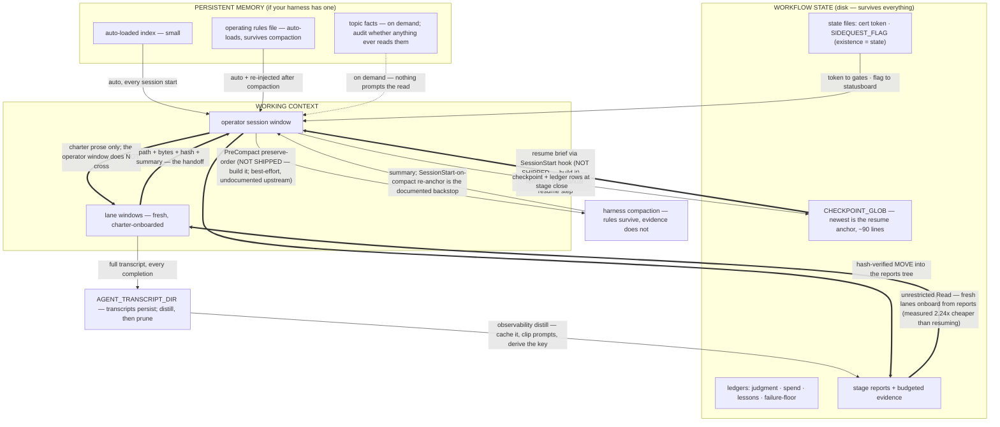

# Context Architecture — how this kit manages memory, state, and the window

*This document is the full treatment of `BLUEPRINT.md` §7, which summarizes it in
five points. It describes what each context layer contains, how each is managed,
what crosses each boundary, and which parts are portable doctrine versus
harness-specific wiring. Evidence figures come from the reference build and are
de-identified per the convention in BLUEPRINT §11.*

---

## 1. The three layers

The architecture separates information into three layers. To classify any artifact,
apply one test: *does it survive a session clear without anyone remembering to carry
it?*

- Survives, and the model loads it automatically → **persistent memory**.
- Survives, but something must choose to read it → **workflow state**.
- Does not survive → **working context**. Working context must never be the only
  copy of anything that matters.

| Layer | Contents | Survives a clear | Survives compaction | Written by | Read by |
|---|---|---|---|---|---|
| Persistent memory | The rules file; any harness auto-memory | Yes, loads automatically | Yes, re-injected from disk | The owner (rules), the model (facts) | Every session, automatically |
| Workflow state | Checkpoints, ledgers, charters, state files, reports | Yes | Yes (never leaves disk) | The operator, at stage closes and gates | Any session or lane that reads it; a resume hook should prompt the read |
| Working context | The operator's window; each lane's window | No | Summary only; tool output is discarded | The conversation itself | Nothing downstream |

The separation stays clean because the layers never share a carrier. Between
sessions, only disk crosses. Into a lane, only charter text crosses. Back from a
lane, only a verified file plus a summary crosses. Anything not deliberately written
for a crossing is lost at that crossing. This is the intended design, provided the
disciplines below are followed.

## 2. Persistent memory: rules load, facts sleep

The **rules file** (module 01's governance file for `{{PROJECT_NAME}}`) is the one
text guaranteed to be present in every window at all times: the harness loads it at
session start and re-injects it from disk after compaction. Because of this
property, treat rules-file lines as expensive. Each line should be traceable to a
specific failure; a rules file grows toward noise otherwise.

If your harness provides an **auto-memory layer** (an index loaded each session plus
topic files loaded on demand), measure its actual behavior before relying on it. On
the reference build, only the small index loaded automatically. The topic files —
96% of the layer by size — loaded only when explicitly read, and nothing ever read
them. Audit whether anything actually reads your memory; an unread memory layer is a
write-only store.

Placement guideline: binding rules go in the rules file; resume-critical information
goes in the checkpoint; durable background facts go in memory topic files;
everything else belongs in workflow state or is allowed to expire with the window.

**Lanes receive none of this automatically.** Harness memory does not cross the
spawn boundary. A lane knows its charter and whatever it reads from disk. Charters
therefore restate the constraints that bind the lane, every time.

**The sync capsule: persist relational state, not just task state.** Task state
(checkpoints, queues, ledgers) is not the only thing a session boundary destroys.
The working calibration between the owner and the assistant — decision style,
shared shorthand, tone, what "good" feels like on this project — normally lives in
working context and dies with it, so each new session spends its opening stretch
re-deriving it from live interaction. On the reference build the owner put that
ramp at roughly the first 30% of the window before collaboration reached its
settled form — **an internal estimate from one owner on one workstation, not an
instrumented measurement**, and repeated here only with that label. The fix is
the same move as everywhere else in this document: put the state on disk
deliberately. Keep a small set of memory files that capture the collaboration
itself — the owner's decision cadence, standing feedback with its reasons,
vocabulary the project has grown — and instruct the session to read them as
calibration sources at startup, not merely as rules. Maintain them as a governed
record rather than as a cache: append an entry when a session produces a new
confirmed pattern, supersede in place when a correction lands, and retire an
entry by promoting it into the durable profile rather than by deleting it. What
this carries is the seedbed, not the grown relationship; the ramp shortens, it
does not vanish. The owner-profile document (module 08's collaboration profile,
if you keep one) is the anchor file of this capsule, and
`modules/08-collaboration/CAPSULE.md` states that governance in full, names the
professional practice each rule is borrowed from, and states what about the
practice is unmeasured.

## 3. Workflow state: the load-bearing layer

The operating model moves value into this layer as early as possible. This practice
is called disk-first discipline. The layer's main citizens:

**The checkpoint** (`{{CHECKPOINT_GLOB}}`; the newest file is authoritative). This is
the only general-purpose carrier between sessions. Its shape contract, at a measured
norm of about 90 lines: the current state of the mainline; the owner's open decision
queue, verbatim; a numbered cold-start resume procedure; and a statement of what it
supersedes. A checkpoint that a new collaborator cannot cold-start from does not
meet the contract. Where a resume hook injects the newest checkpoint automatically
(Section 6 — a design brief; the kit ships no such hook), checkpoint quality directly
determines the quality of every session's first minutes. Until one exists, the
"resume anchor" is a rule your rules file states and a human obeys: module 01's
governance template opens with it.

**The ledgers** (module 04): judgment, lessons, failure-floor, and spend. These are
living documents written at stage closes. They are also the onboarding corpus for
any future collaborator arriving with zero context.

**State files:** the certification token (`{{CERT_TOKEN_FILE}}`) and the side-quest
flag (`{{SIDEQUEST_FLAG}}`, gitignored, where existence of the file is the state).
Module 05's `CONTRACT.md` is the model for documenting a state file: schema,
lifecycle, reader behavior, and failure rendering.

**Reports and evidence.** Reports are the onboarding material; evidence supports
them. Two disciplines keep this sustainable:

- **The handoff.** Lane report bodies transfer as bytes, never as re-emitted text.
  The lane writes a gitignored scratch file and returns the path, byte count, hash,
  and a short summary. The operator verifies the hash, spot-reads the file, and
  moves it into the reports tree. A language model re-typing a large body "verbatim"
  is a hand copy with unverifiable fidelity — the reference build recorded a silent
  corruption produced exactly this way. A file move is byte-identical by
  construction, and the hash makes it verifiable. Enforce the redirect with a hook
  where the harness allows it (Section 6 — a design brief; the kit ships no such
  hook, so this discipline is prose until you write one).
- **Disclosed condensation.** The archived report is always complete. Quoted copies
  may condense repetitive material only if the elision is disclosed where it occurs,
  with a count and a pointer to the full list. Verdicts, per-item dispositions, and
  halts are never condensed.
- **Evidence budgets.** Each charter states its expected proof-artifact volume.
  On the reference build, unbudgeted lane evidence became the largest artifact class
  in the repository by an order of magnitude.

**Transcripts are a cache, not the record.** On at least one harness, every lane's
full transcript persists on disk indefinitely and nothing prunes it. The reference
build accumulated roughly ten times more unread lane transcript than session
transcript before anyone noticed the layer existed. (`{{AGENT_TRANSCRIPT_DIR}}`
names the location for the status board.) The retention policy is **distill, then
prune**:

1. An observability step distills each transcript into a bounded per-agent report:
   identity, model tier, caller, the prompt (clipped), the outcome, and token count.
2. Transcripts older than the current phase plus one are pruned at phase gates,
   after the distilled reports are verified to exist. (**Phase**, like **stage**
   and **round**, is defined once in `modules/04-ledgers/README.md`: one or more
   rounds delivering one milestone, ending at an owner gate. A project with no
   grouping above the round reads "phase" as "round" and prunes at round
   closes.)
3. Distilled reports are never pruned, and raw transcripts are never pruned before
   distillation. They are the only source for audits the reports cannot support; the
   reference build's rework audit — 10% of all agent output, invisible to every
   ledger — was possible only because the raw transcripts still existed.

## 4. Working context: the layer that does not survive

**What fills the windows.** The operator's window holds the fixed preamble (rules
plus memory index), then every tool output and every lane summary. A lane's window
holds its charter, then its own tool output.

**Compaction preserves rules and discards evidence.** When a window reaches the
harness threshold, conversation history is replaced by a summary and full tool
outputs are dropped; the rules file and memory index are re-injected from disk.
Anything not yet on disk survives only to the extent the summarizer kept it. The
defense is disk-first discipline. The instrument is the status board's context bar
and its clear mark (`{{STATUS_CLEAR_MARK_PCT}}`): the mark encodes a property of
your documentation, not of the model — it sits where clearing costs less than
continuing, and the checkpoint is what makes clearing cheap.

**Fresh lanes by default.** This is the strongest-evidenced rule in this document.
On the reference build, one lane resumed across five stages climbed monotonically to
2.24× the cost of a fresh lane onboarded from the reports on disk, and the fresh
lane completed strictly more work. A monotonic ramp followed by a drop indicates
transcript accumulation, not increasing task difficulty. At stage boundaries, start
a fresh lane onboarded from disk by default; resuming a transcript requires a stated
reason in the ledger.

**The context capsule generalizes the rule** (module 06). The capsule — "the minimum
a fresh session or subagent would need" — is one instance of the universal
principle: nothing crosses a context boundary except what was written for the
crossing. Side quests are one boundary; session clears and lane spawns are the
others.

## 5. The flow, in one picture

## 6. The wiring (Claude Code; the harness caveat applies)

> **NOT SHIPPED — this section is a design brief, not documentation of code in this
> kit.** The three hooks below — SessionStart, PreCompact, and the handoff PreToolUse
> gate — ran on the reference build and are described here in enough detail to be
> rebuilt. **No module, template, settings file or tool in this kit implements any of
> them**, and `hook_model_gate.py` has no reports-tree branch. Nothing here has a
> fixture, a selftest, or a smoke phase behind it. Read it as the specification you
> would build from, and expect to write the code and the fixtures yourself. (The
> shipped enforcement layer is module 02's model-tier gate, and only that.)

Sections 1–5 are portable doctrine. This section describes the wiring on the kit's
reference harness. On a different stack, keep the doctrine and rebuild the wiring.

**SessionStart hook** (sources `startup`, `resume`, `clear`, `compact`). Injects a
capped resume brief: the newest checkpoint's resume section, the owner's decision
queue, the side-quest flag state, and the certification-token line. Design rules,
each learned from a real failure:

- Hard-cap the brief. A resume brief that costs a page of context defeats its own
  purpose.
- Emit a short re-anchor variant on the `compact` source. The harness has just
  re-injected the rules; do not repeat them.
- Emit ASCII-safe JSON. On the reference build, a console code page rejected an
  em dash lifted from a real checkpoint and the entire brief was lost on the hook's
  first run.
- Put a liveness marker on every output path, including failure paths, so a dead
  hook can never be mistaken for a quiet one.

**PreCompact hook** (triggers `auto`, `manual`). Writes a preservation order to a
gitignored state file: the resume line, the decision queue, in-flight lane state and
any unsaved output, and unfinished close-checklist steps. It emits only a short
schema-valid status message with a liveness marker. Do not try to send the order to
the summarizer: on the reference harness this was measured live (2026-08-20), and
PreCompact output cannot carry `additionalContext` — the harness rejects it at
schema validation before the summarizer sees it. The working pattern is a two-hop
disk relay: PreCompact writes the state file; the SessionStart `compact` re-anchor
detects it and tells the post-compact session that anything the summary dropped is
recoverable from disk. Guard the measured contract with a fixture so the rejected
output shape cannot return, and add a round-trip fixture for the relay itself.

**Pipe-test both hooks** with a fixture table (BLUEPRINT §10, bootstrap rule 4):
negative controls, a dead-man fixture, and an encoding regression. Then wire the
armed-check and the suite's summary line into the verify runner, with a floor on the
fixture count — a well-formed `0/0` from a runner that executed nothing must read as
red.

**The handoff hook** (PreToolUse). Deny subagent writes under the reports tree with
a deny message that teaches the scratch convention, and keep the scratch path open
at every depth. Two portability rules, both paid for on the reference build:

- Derive the repository root from the hook's own file location, never from a
  hardcoded path. A hardcoded root passed every local check and failed on CI's cold
  clone the same day. A local pass is a claim about a directory, not about the
  repository.
- Treat any agent-identity fields you discriminate on as measured, not documented.
  Pin the measurement with a fixture pair — the same write submitted from the
  subagent side and the operator side. If the two fixtures ever return the same
  verdict, the discriminator has stopped working, and the gate is what reports it.

## 7. Why this is cost architecture

Every measured context cost on the reference build was a carrying cost, not a doing
cost: window accumulation (2.24×), boundary rework (10% of all agent output, a third
of it lanes launched with empty payloads — the origin of the HALT guard), and report
bodies crossing the operator window twice (the origin of the handoff). One honest
limit remains: the operator's own window, plausibly the largest driver of all, is
the one no per-lane instrument can see. A cost discipline with denominators
(BLUEPRINT §6) that has no denominator for its own operator is incomplete by its own
standard. Instrument it if your harness allows.
